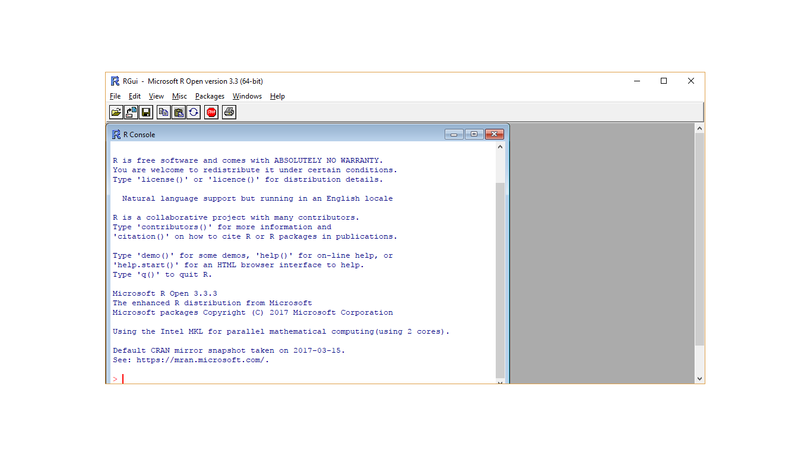
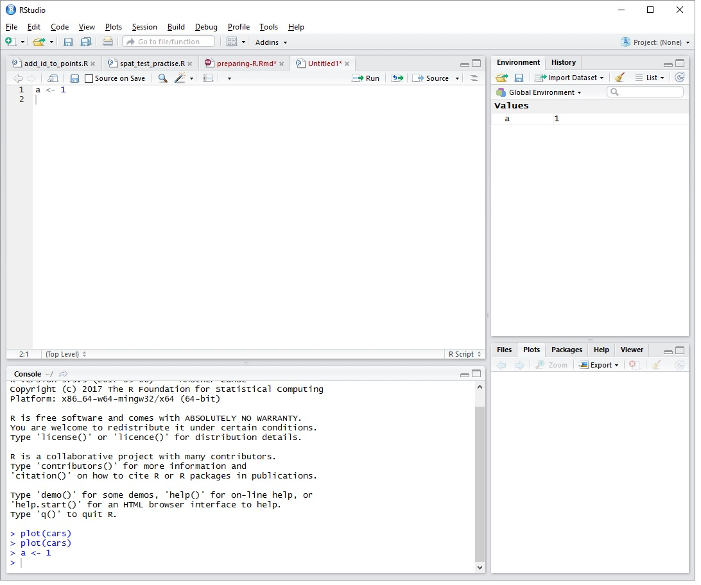

---
output:
  pdf_document: default
---

# Introduction to R
This chapter introduces readers to the basics of working with data in R. We will start with installing R in your computer and getting familiar with RStudio interface. These will be followed by the basics of handling data in R.

## R and RStudio

### Installation of R
- The latest version of R is `r version[13:14]`.
- R is available for Windows, Mac OS and Linux.
- The installation files can be downloaded from <https://cran.r-project.org/>.
- Users can install different versions of R in a same machine or computer.
- There is no need to uninstall if you want to upgrade the currently installed R.

### Starting R

Double click on R icon and you should get this



You should see an R console.

### Installation of RStudio
RStudio installation files can be downloaded from <http://www.rstudio.com/>.
First, make sure you have RStudio successfully installed.

#### Starting RStudio
You can double click on RStudio icon and you will see this:



#### Why RStudio?
- Working with R console is alright. 
- But for many people, they prefer to communicate with R using a graphical user interface (GUI).
- RStudio is the popular GUI and intergrated developement environment (IDE) for R.
- Other R IDE includes Microsoft R

Check this links for more info:

1.  RStudio <https://www.rstudio.com/>
2.  Microsoft R <http://blog.revolutionanalytics.com/2016/01/microsoft-r-open.html>

#### RStudio interface
You should be able to see 4 panes in the layout. You should see that

1. Console - the lower left pane. It tells you about your R information.
2. Source - the upper left pane. It shows the active files.
3. Environment and History - the upper right pane. It shows the currently loaded data files and values, and command history.
4. Miscellaneous - the lower right pane. It contains most important tabs, which are Files, Plots, Packages, Help and Viewer. It list file names, show plots, show packages, display help document and view outputs.


## Functions and objects
Before we start, there are a number of basics to understand the syntax in R. These are functions and objects.

### Functions
R commands are in form of `function()`. You can think of MS Excel function. Inside a function, there will be a number of options. We will see this as we go through the examples later.

### Objects
Object is a sort of like container. You assign an object by giving it a name on left side of `<-` or `=`. For the sake of consistency, we will use `<-` throughout, although `=` is perfectly fine (some might argue about this though).
# - variable, data (data frame, matrix, list)
```{r}
x <- 1
y = 2
z <- x + y
z  # type object name, you'll get the value
```
But later you will see that `=` is used to set values for options of a function, i.e. inside the bracket after the function's name. For example, `function(option1 = value, option2 = value, ...)`. Thus, some prefer using `<-` to avoid confusion with `=` for options.


## Working with packages

### About packages 
R uses packages to perform its tasks.

There are two common packages:

1.  `base` packages 
2.  `user-contributed` packages

- The base packages come with the installation of R
- The base package provides basic but adequate functions to perform many standard data management, visualization and analysis.
- However, user needs to install user-contributed packages if they need to perform functions (tasks) not available in the base package
- User-contributed packages allow users to perform more advanced and more complicated functions 
- There are more than 10200 packages as of March 2017

For a complete list of packages, see <https://cran.r-project.org/web/packages/>

### Package installation
You can install user-contributed packages through:

1.  Internet (to cran)
2.  Github packages
3.  Local zip files

We will learn to install a few small packages.

Basically, a function to install a package will look like this
```{r, eval=FALSE}
install.packages("package.name")
```

To install a package, saya `car`
1.  put your cursor in the CONSOLE pane
2.  type the codes below
```{r, eval=FALSE}
install.packages("car")
```
3.  press Ctrl + ENTER

### Loading packages
Basically, to utilize a package, it has to be loaded using `library()` function,
```{r, eval=FALSE}
library("package.name")
```

For example, we load the newly installed `car` package
```{r, eval=FALSE}
library("car")
```


## Working directory
In general, R reads and saves data and other files into a working directory. Therefore, a user must create or specify the working directory to work with R. This is a good practice. 

A working directory:

1.  stores all the outputs such as the plots, html files, pdf files 
2.  contains your data

Creating a working directory is a simple BUT an important step. 

Unfortunately, many users do not pay attention to this and forget to set it. So, remember, this is a very important step to work in R.

### Setting a working directory

To set your working directory:

1.  Go back to RStudio's Miscellaneous pane.
2.  In the Files tab, click *...* 
3.  Navigate to the folder containing your data or any folder you want to work in.
4.  Click *More* 
5.  Click *Set as working directory*

or simply use `setwd` function to do so. 
```{r, eval=FALSE}
setwd("path to your folder")
```
for example in Windows
```{r, eval=FALSE}
setwd("C:/myfolder")
```
or in Mac OS/Linux
```{r, eval=FALSE}
setwd("~/myfolder")
```


## Data management
This section is concerned with reading data from dataset and displaying data.

### Reading data set
Easiest is to read .csv file,
```{r}
data <- read.csv("cholest.csv")
```

For SPSS and STATA files, we need `foreign` package,
```{r, eval=FALSE}
library("foreign")
data <- read.spss("cholest.sav", as.data.frame = TRUE)
data <- read.dta("cholest.dta", convert.factors = TRUE)
```

For Excel file, we need `readxl` package,
```{r eval=FALSE}
library("readxl")
data <- read_excel("cholest.xlsx", sheet = 1)
```

### Viewing data set
Easy, just type the name,
```{r, eval=FALSE}
data
```

Nicer, using `View()`
```{r, eval=FALSE}
View(data)
```

View only the first six observations,
```{r}
head(data)
```
and the last six observations,
```{r}
tail(data)
```

Important tasks
```{r, eval=FALSE}
dim(data)
str(data)
names(data)
```

### Exporting data set from R

You can also export data into various formats using similar packages.

For example, 

1.  to export data into a *comma separated version* (.csv) file, we can use `write.csv` function. 
2.  to export data into stata format, we can use `write.dta` function

```{r, eval=FALSE}
write.csv(data, 'data.csv')
write.dta(data, 'data.dta') 
```

## More about data management
In this section, we will deal with more advanced data management (subsetting, recoding and creating new variables) and direct data entry (especially useful for tables).

Let say we use `cholest.csv`,
```{r}
data <- read.csv("cholest.csv")
dim(data)
str(data)
names(data)
head(data); tail(data)
```

### Subsetting

Subsetting means "selecting parts of data". It allows selecting only a number of variables (columns) or observations (rows) from a dataframe. There are ways to do that.

#### Selecting a column (variable) or a row (observation)

Let say, to select `age`
```{r}
data$age
```
to select the 7th observation,
```{r}
data[7, ]
```

#### Selecting columns

Let us create a new data frame with only `chol`, `age` and `sex` as the variables
```{r}
data_col <- subset(data, select = c("chol", "age", "sex"))
str(data_col)
```

alternatively, we can use square brackets
```{r}
data_col <- data[ , c("chol", "age", "sex")]
str(data_col)
```

you may even select by the column numbers
```{r}
data_col <- data[ , c(1:2, 4)]
str(data_col)
```
selecting column 1 to 2, and column 4.

#### Selecting rows

To select 7th to 14th observations,
```{r}
data_row <- data[7:14, ]
data_row
```

Practically, we want to choose observations based on certain criteria, for example those aged > 35 year old,
```{r}
data_row <- subset(data, age > 35)
str(data_row)
```

alternatively, we can use square brackets,
```{r}
data_row <- data[data$age > 35, ]
str(data_row)
```

#### Select rows and columns together

Select those aged > 35, and `chol`, `age`, `sex` variables,
```{r}
data_rc <- subset(data, age > 35 & sex == 1, select = c("chol", "age", "sex"))
str(data_rc)
```

#### Creating a new variable

For example, create age in months,
```{r}
data$age_month <- data$age * 12
data$age_month
```

### Recoding

### Categorize into new variables

#### From a numerical variable

```{r}
data$age_cat <- cut(data$age, breaks = c(-Inf,40,50,Inf),
                    labels = c("< 40", "40-49", "> 50"))
table(data$age_cat)
str(data$age_cat)
```

#### From a categorical variable

Using `age_cat` variable,
```{r}
levels(data$age_cat)
table(data$age_cat)
```
Only one observation labeled as `> 50`. We want to combine `40-49` with `> 50`.
```{r}
library(car)
data$age_cat1 <- recode(data$age_cat, "c('40-49','> 50') = '40 & above'")
table(data$age_cat1)  # combined
```

### Direct data entry

We may also enter short data directly using `read.table`.

For example, a standard data frame,

ID | Group | BMI |
---|---|---:|
1 | Fat | 30 |
2 | Fat | 31 | 
3 | Fat | 32 |
4 | Thin | 20 |
5 | Thin | 19 |
6 | Thin | 18 |

```{r}
data_frame <- read.table(header = TRUE, text = "
ID Group BMI
1 Fat 30
2 Fat 31
3 Fat 32
4 Thin 20
5 Thin 19
6 Thin 18
")
str(data_frame)
data_frame
```

or a table,

| | Cancer | No Cancer
| --- | ---: | ---:
| Smoker | 80 | 10
| Non-smoker | 5 | 100

```{r}
data_table <- read.table(header = FALSE, text = "
80 10
5 100
                        ")
colnames(data_table) <- cancer <- c("Cancer", "No Cancer")
rownames(data_table) <- c("Smoker", "Non-smoker")
str(data_table)  # still a data frame, but laid out in form of a table.
data_table
```
The numbers are separated by space. We set the row and column names by `rownames` and `colnames` respectively.

## Summary
In this chapter, we learned some basics in using R effectively. In the next chapter, we are going to learn about how to explore the variables by means of basic descriptive statistics.
