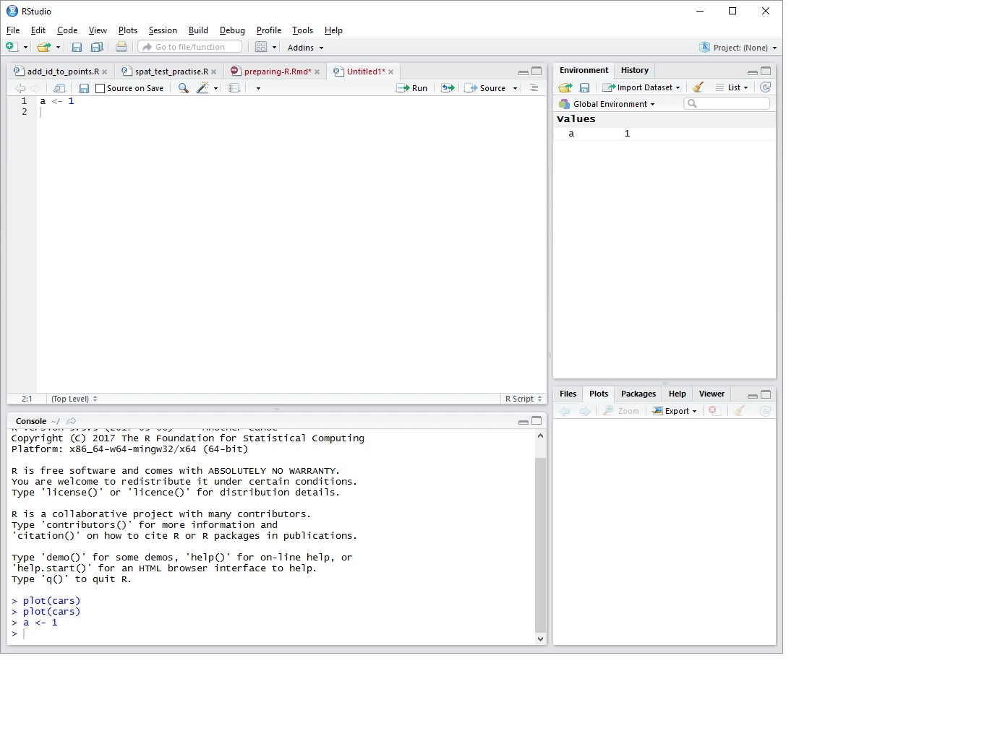

# Introduction to R

## Introduction

This chapter introduces readers to the basics of working with data in R. In this chapter, we show you these steps:

1.  Installing R and RStudio
2.  Describing the R and RStudio interfaces
3.  Installing R packages
4.  Upgrading your R version
5.  Setting up your working directory
6.  Creating a new project

## Objectives of the chapter

At the end of the chapter, you will be able:

1.  to install R
2.  to install RStudio
3.  to install R packages
4.  upgrade R version
5.  set up your working directory
6.  create a new project

## Installation of R

The latest version of R is `r version[13:14]`. R can run on Windows OS, Mac OS and Linux distribution. 

You need to download the R installation files from <https://cran.r-project.org/>. And you can install many versions of R in one single machine. There is no need to uninstall if you want to upgrade the currently installed R. The size of installtion files as of today `r Sys.Date()` is about 80 megabytes. 

The links to install R for

1.  Linux is <https://cran.r-project.org/bin/linux/>
2.  Windows OS is <https://cran.r-project.org/bin/windows/>. Then click `base` subdirectories
3.  Mac OS is <https://cran.r-project.org/bin/macosx/>

For Windows OS users, the details of installation processes for R version 3.4.4 can be found here <https://cran.r-project.org/bin/windows/base/README.R-3.4.4>

### Starting R

You can start R software like starting any other software. In Windows OS, double click on R icon on the Start page and you should get this: 


If you can see the R GUI, you are good to go. In the figure, you can see, I am using the Microsoft R Open version 3.3.3. In your case, the R will be shown as just R version 3.3.3. 


## Installation of RStudio

We encourage you to install RStudio in your machine. In the RStudio website, the company describe rStudio like this. 

*RStudio is an integrated development environment (IDE) for R. It includes a console, syntax-highlighting editor that supports direct code execution, as well as tools for plotting, history, debugging and workspace management.* 

The full information about RStudio can be found here <https://www.rstudio.com/products/rstudio/>. RStudio is available in open source and commercial editions. It runs on the desktop with Windows OS, Mac OS, and Linux OS. It can also run in a browser connected to RStudio Server or RStudio Server Pro.

RStudio installation files can be downloaded from <http://www.rstudio.com/products/rstudio/download/>. Take note that it is recommended that you, firstly install R before trying to install RStudio. In the download link, choose the Free RStudio Desktop and click the download button. From there, you can a list of downloadable RStudio depending on the supported platforms. 

From there, download the installation files. Once the download has finished, follow the simple instructions. 

#### Starting RStudio

You can double click on RStudio icon in the menu or your start page on your computer desktop and you will see the RStudio interface. Take note of the R version in the RStudio Console, most probably on the right hand side of the computer screen.   



#### Why RStudio?

Based on our experience and the experience of others, we feel working with RStudio helps new users learn R quicker in the beginning. 

The R GUI is way too intimidating to new users especially to those with no experience with programming language. What we want to say is that, working with R console is alright, but for majority of new users, they prefer to communicate with R using a RStudio.

RStudio is more than a GUI. RStudio is intergrated developement environment (IDE) for R. Other R IDEs includes Microsoft R Open. 
To learn more about R IDE and GUI, check out these links:

1.  RStudio at <https://www.rstudio.com/>
2.  Microsoft R Open at <https://mran.microsoft.com/open>
3.  Tinn-R at <https://sourceforge.net/p/tinn-r/wiki/Home/>

#### RStudio interface

You should be able to see 3 panes in the layout. The panes are:

1.  Console pane - on the right side of your computer screen. It tells you about your R, when you first start RStudio.
2.  Source pane - on the upper right of your computer screen. This will show the R script, R markdown files and other active files. The first time you start RStudio, this pane is not shown. 3.  Environment and History panes - on the upper left of your computer screen. It is where you can see the objects created by R, the codes that you have run and the connections to data sources such as databases. 
4. Miscellaneous - on the lower left screen of your computer. It contains smaller tabs, Files, Plots, Packages, Help and Viewer. This tabs can list file names, show plots, show packages, display help document and view outputs.


## Functions and objects

Before we start, there are a number of basics that you must know to understand the syntax in R. These are functions and objects.

### Functions

R commands are in the form of `function()`. If you are familiar with MS Excel, think of MS Excel function. Inside a function, there will be a number of arguments. And for each arguement, you need provide the parameter. We will see this as we go through the examples later.

### Objects

An object is like a container. You can assign an object by giving it a name on the left side of this arrow `<-` or this `=` symbols. For the sake of consistency, we will use `<-` throughout, although `=` is perfectly fine (some might argue about this though).

# - variable, data (data frame, matrix, list)

```{r}
x <- 1
y = 2
z <- x + y
z  # type object name, you'll get the value
```

Now you will notice that the `=` symbol is used to set the value (or parameter) for the argument a function, i.e. inside the bracket after the function's name. For example, `function(option1 = value, option2 = value, ...)`. Thus, some people prefer using `<-` to avoid confusion with `=` for setting the parameter values or options.


## Packages

R run on packages. In each package, there are function. This can be represented as **package::function()**. This packages will be installed in your home directory. To know where this directory is located, type this 

```{r, eval=FALSE}
.libPaths()
```

which will return `r .libPaths()`. 

There are two packages in R:

1.  `base` packages 
2.  `user-contributed` packages

### base package

The base packages come with the installation of R. They provide basic but adequate functions to perform many standard data management, visualization and analysis.

### user-contributed packages 

However, in many situations, user needs to install user-contributed packages to deal with their data. These user-contributed packages are necessary to perform tasks that are not available in the base packages.


User-contributed packages allow users to perform more advanced and more complicated functions and they are contributed by R users all over the world. There are more than 12000 packages as of April 2018

For a complete list of packages, see <https://cran.r-project.org/web/packages/>. The packages name can be found here <https://cran.r-project.org/web/packages/available_packages_by_name.html>. CRAN Task Views (<https://cran.r-project.org/web/views/>) aggregated all the packages according to their main tasks for examples packages to deal with:

1.  *Clinical Trials*: Clinical Trial Design, Monitoring and Analysis <https://cran.r-project.org/web/views/ClinicalTrials.html>
2.  *MetaAnalysis*: <https://cran.r-project.org/web/views/MetaAnalysis.html>
3.  *SocialSciences*: Statistics for Social Sciences <https://cran.r-project.org/web/views/SocialSciences.html>
4.  *Spatial*: Analysis of Spatial data <https://cran.r-project.org/web/views/Spatial.html>  

### Package installation

You can install user-contributed packages through:

1.  Internet (to cran)
2.  Github packages
3.  Local zip files

We will learn to install a few small packages. Best if you have active internet line. 

Basically, a function to install a package looks like this:

```{r, eval=FALSE}
install.packages("package.name.to.be.installed")
```

To install a package, say `car`

1.  put your cursor in the CONSOLE pane
2.  type the codes below

```{r, eval=FALSE}
install.packages("car", dependencies = TRUE)
```
3.  press Ctrl + ENTER

### Loading packages


Basically, to utilize a package, it has to be loaded using `library()` function,

```{r, eval=FALSE}
library("package.name")
```

For example, we load the newly installed `car` package

```{r, eval=FALSE}
library("car")
```


## Working directory

In general, R reads and saves data and other files into a working directory. Therefore, a user must create or specify the working directory to work with R. This is a good practice. 

A working directory:

1.  stores all the outputs such as the plots, html files, pdf files 
2.  contains your data

Creating a working directory is a simple BUT an important step. 

Unfortunately, many users do not pay attention to this and forget to set it. So, remember, this is a very important step to work in R.

### Setting a working directory

To set your working directory:

1.  Go back to RStudio's Miscellaneous pane.
2.  In the Files tab, click *...* 
3.  Navigate to the folder containing your data or any folder you want to work in.
4.  Click *More* 
5.  Click *Set as working directory*

or simply use `setwd` function to do so. 
```{r, eval=FALSE}
setwd("path to your folder")
```
for example in Windows
```{r, eval=FALSE}
setwd("C:/myfolder")
```
or in Mac OS/Linux
```{r, eval=FALSE}
setwd("~/myfolder")
```

## Setting up a new project

The most recommended way to start working with your data in R especially RStudio is by creating a new project. You can go to the menu, click **File**, then click **New Project**. This will force RStudio to start fresh, to remove all the objects and create a new working directory. 
